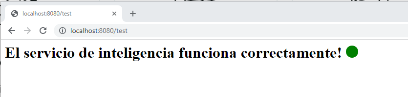

# Operación Fuego de Quasar

_Han Solo ha sido recientemente nombrado General de la Alianza
Rebelde y busca dar un gran golpe contra el Imperio Galáctico para
reavivar la llama de la resistencia.
El servicio de inteligencia rebelde ha detectado un llamado de auxilio de
una nave portacarga imperial a la deriva en un campo de asteroides. El
manifiesto de la nave es ultra clasificado, pero se rumorea que
transporta raciones y armamento para una legión entera_


## Comenzando 🚀

_Estas instrucciones te permitirán obtener una copia del proyecto en funcionamiento en tu máquina local para propósitos de desarrollo y pruebas._
f

### Pre-requisitos 📋

```
JDK 11 o superior
Spring Framework
Maven o utilizar el wrapper embebido en el proyecto
IntelliJ 2021.3 o superior
```

### Instalación 🔧

El siguiente instructivo se presenta para un entorno sobre **Windows 10**, aunque en caso de tener algun sistema operativo basado en unix, deberás simplemente reemplazar 
```.\mvwn.cmd``` por ```.\mvwn```

_En caso de que se quiera lanzar la aplicación desde IntelliJ es necesario seguir los siguientes pasos:_

1. _Debemos descargar las dependencias, para ello es posible hacer click sobre el archivo pom.xml, darle click a **Maven** y luego a **Reload Project**, de esta forma se descargarán automáticamente todas las dependencias definidas en el pom.xml_

2. _Para levantar el servicio, basta con tocar los comandos Ctrl+F9 para Buildear la aplicación, y Shift+f10 para lanzarla._

_En caso de que se desee lanzar la aplicación por consola, es necesario utilizar el wrapper de maven mediante mvwn.cmd, posicionarse sobre el raiz del proyecto y lanzar el comando_

_Para esto, ejecutar el comando:_

```
.\mvwn.cmd spring-boot:run
```

_En este punto es posible acceder al endpoint http://localhost:5000/test para verificar si el servicio está funcionando correctamente._


## Ejecucion

### Nivel 1️

Para la ejecución de las pruebas asociadas a los métodos del Nivel 1, 
se sugiere ver la estructura de metodos definidos en el directorio de test.
Para realizar la ejecución, ver la sección de pruebas de este documento.

### Nivel 2 y 3

Tanto la ejecución del nivel 2 y 3 pueden realizarse de forma local o de forma remota accediendo a las siguientes URL

[Entorno Local](http://localhost:5000/intelligenceservice/v1/test)

[Entorno Remoto](http://intelligenceservice-env-3.eba-igkzwmap.us-east-2.elasticbeanstalk.com/intelligenceservice/v1/test)


## Ejecutando las pruebas ⚙️

_Para ejecutar los test generados es necesario ubicarse sobre el directorio raiz y lanzar el comando:_

```console
.\mvwn.cmd test
```

## Construido con 🛠️

* [Spring Boot](https://spring.io/) - Framework para web apps en Java
* [Maven](https://maven.apache.org/) - Manejador de dependencias
* [AWS Elastic Beanstalk](https://aws.amazon.com/es/elasticbeanstalk/) - Servicio Cloud para aplicaciones


## Wiki 📖

Es posible encontrar toda la documentación asociada al proceso de implementación, desiciones de diseño, ejemplos de problemas encontrados en la [Wiki](https://github.com/emosegue/quasar_challenge/wiki)

## Autores ✒️

* **Emanuel Mosegue** - *Trabajo Inicial* - [emosegue](https://github.com/emosegue) (emanuelmosegue@gmail.com)

## Licencia 📄

Este proyecto está realizado bajo fines de evaluación como presentación a un challenge backend para MercadoLibre - Marzo 2022

---
